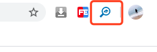

# debug `window.__DEBUG__` 下数据

## 背景

目前在 smarty 模板中，查看数据不是很清晰，为此编写一个转成 json 的页面

## 效果


## 使用方式

```
git clone git@github.com:leermao/debugger_window_data.git
```

- 将代码 clone 到本机
- 然后打开 chrome 浏览器，右上角的三个点 => 更过工具 =>扩展程序
  
- 打开开发者模式 => 加载已经解压的扩展程序
  
- 选择代码路径就可以直接使用
- 出现下面图标算成功
  

如果插件有更新 直接刷新插件就可以

## 注意

由于项目直接查找 `window.__DEBUG__`下面的数据，所以我们可以在项目中手动设置一些想展示的数据
比如

```js
window.__DEBUG__.xxx = {
  name: "",
  age: "",
};
```

如果想读取后端数据，可以让后端同学插入下面下面代码

```php
<script>
    window.__DEBUG__ = {
      TEMPLATE_DATA:
    }
</script>

TemplateData 中 $data 为页面所使用的数据
```
